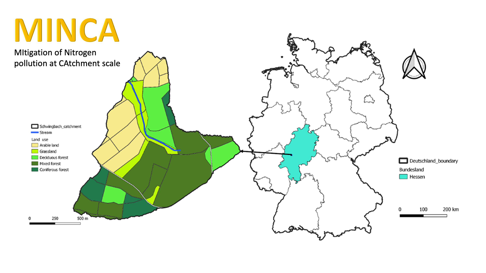

# MINCA - MItigation of Nitrogen pollution at CAtchment scale

Nitrogen balance and reduction of greenhouse gas emissions and nitrogen pollution
from the Vollnkirchner Bach catchment.

## Site scale test simulations

- O2
- Bulk density
- Diffusivity

## Regional scale 

### Different spatial resolution

